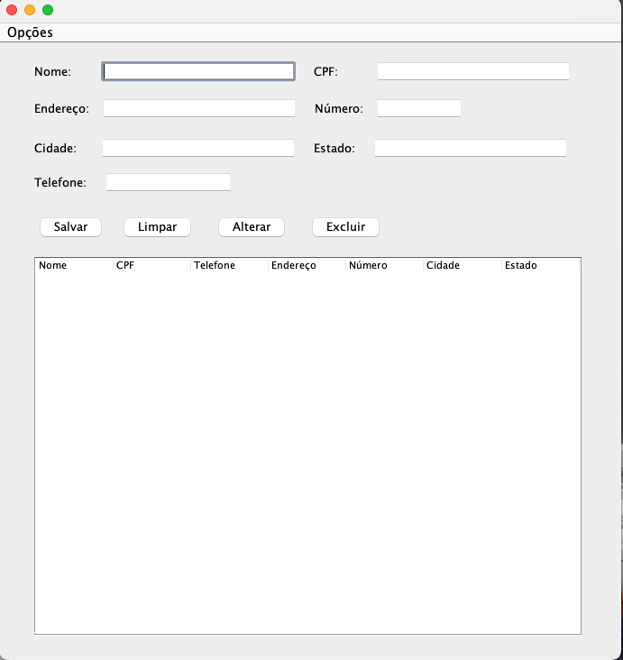

# Projeto 1 EBAC: Cadastro de clientes

## Descrição
Projeto desenvolvido através de aulas ministradas dentro da plataforma da EBAC. 

## Objetivo

O objetivo deste projeto é utilizar de todo o conhecimento até então passado, através de um cadastro de clientes que é feito em um formulário, como este abaixo:

